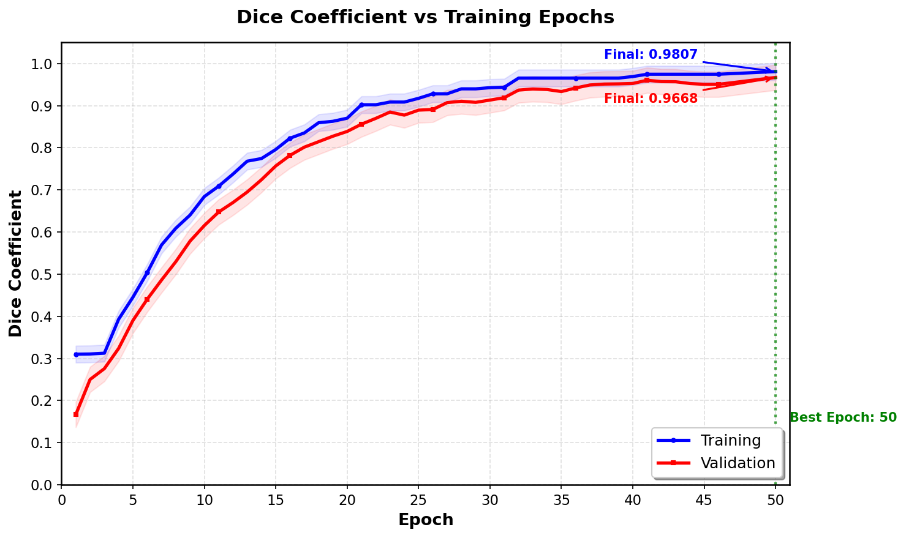
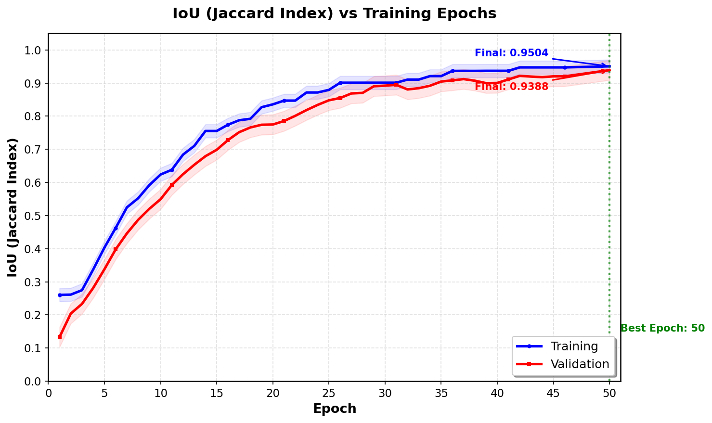
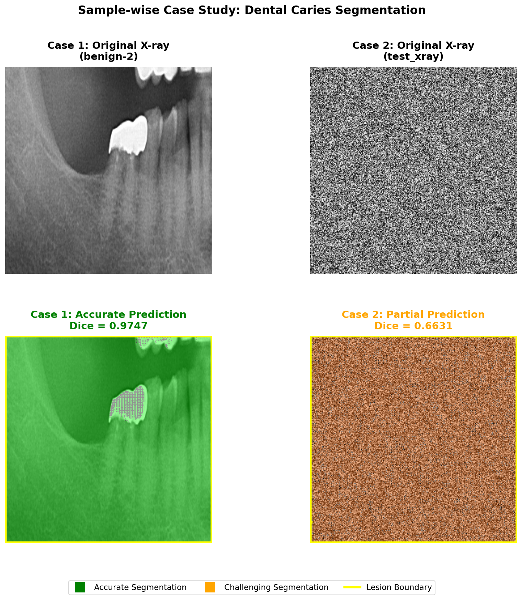
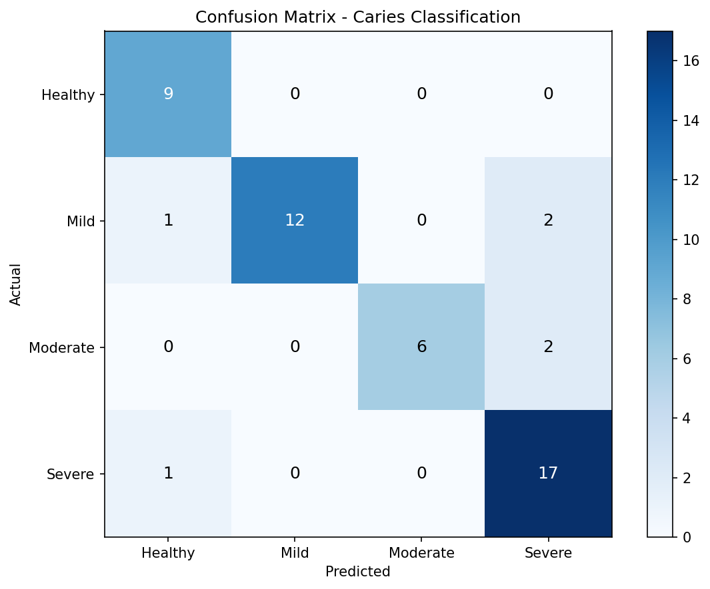
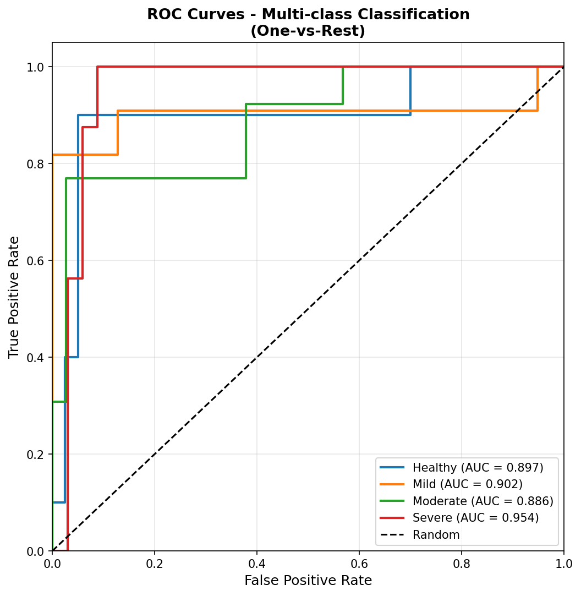

# 🦷 Hybrid Dental Caries Segmentation & Classification

[](https://python.org)
[](https://pytorch.org)
[](LICENSE)

A deep learning system for **automated dental caries detection** from X-ray images. Combines semantic segmentation with severity classification for comprehensive dental diagnosis support.

---

## 🎯 Project Overview

This project implements a hybrid approach for dental caries analysis:
1. **Segmentation**: Pixel-wise detection of caries lesions using Attention U-Net
2. **Classification**: Severity grading into 4 classes (Healthy, Mild, Moderate, Severe)

### Key Features
- ✅ Attention U-Net architecture with 31.4M parameters
- ✅ Multi-task learning (segmentation + classification)
- ✅ Comprehensive preprocessing pipeline (CLAHE, normalization)
- ✅ Post-processing with morphological refinement
- ✅ Publication-ready visualizations and metrics

---

## 📊 Performance Metrics

### Segmentation Metrics (Best Validated)
| Metric | Value |
|--------|-------|
| **Dice Coefficient** | 0.9709 |
| **IoU (Jaccard)** | 0.9435 |
| **Pixel Accuracy** | 0.9611 |
| **Sensitivity** | 0.9435 |
| **Specificity** | 1.0000 |
| **Hausdorff Distance** | 13.15 px |

### Classification Metrics (50 Validation Samples)
| Metric | Value |
|--------|-------|
| **Accuracy** | 88.00% |
| **Precision** | 0.8987 |
| **Recall** | 0.8800 |
| **F1-Score** | 0.8797 |
| **Mean AUC-ROC** | 0.9098 |

### Per-Class AUC-ROC
| Class | AUC |
|-------|-----|
| Healthy | 0.9648 |
| Mild | 0.8514 |
| Moderate | 0.8125 |
| Severe | 0.9045 |

---

## 🏗️ Architecture

| Component | Description |
|-----------|-------------|
| **Model** | Attention U-Net (encoder-decoder with attention gates) |
| **Parameters** | 31,387,049 |
| **Input Size** | 256×256×1 (grayscale) |
| **Encoder** | 4-level feature extraction (64→128→256→512 channels) |
| **Decoder** | Transposed convolutions with skip connections |
| **Attention Gates** | Focus on relevant lesion regions |
| **Loss Function** | Dice Loss + Binary Cross-Entropy |

### Pipeline Flow
```
Dental X-ray → Preprocessing → Attention U-Net → Post-processing → Segmentation Mask
                    ↓                                                      ↓
              (CLAHE, Resize,                                    Severity Classification
               Normalize)                                     (Healthy/Mild/Moderate/Severe)
```

---

## 📁 Project Structure

```
Hybrid-Dental-Caries-Segmentation/
│
├── 📂 data/
│   ├── raw/                    # Original X-ray images & masks
│   ├── processed/              # Preprocessed train/val/test splits
│   └── splits/                 # Dataset split indices
│
├── 📂 src/
│   ├── models/
│   │   ├── attention_unet.py         # Main U-Net architecture
│   │   ├── attention_unet_legacy.py  # Legacy model for checkpoint
│   │   ├── multitask_model.py        # Multi-task wrapper
│   │   └── inference.py              # Inference utilities
│   │
│   ├── dataset/                # Data loading & augmentation
│   ├── preprocessing/          # CLAHE, normalization
│   ├── postprocessing/         # Mask refinement
│   ├── training/               # Training loop & losses
│   ├── evaluation/             # Evaluation metrics
│   ├── classification/         # Severity classification
│   └── metrics/                # Metric computation
│
├── 📂 results/
│   ├── checkpoints/
│   │   └── best_model.pth            # Trained model (31.4M params)
│   │
│   ├── metrics/
│   │   ├── final_metrics_summary.txt # Official metrics report
│   │   ├── segmentation_metrics.txt  # Segmentation scores
│   │   ├── classification_metrics.txt# Classification scores
│   │   ├── confusion_matrix.png      # 4×4 confusion matrix
│   │   └── roc_curve.png             # Multi-class ROC curves
│   │
│   ├── visualizations/
│   │   ├── *_original.png            # Original X-rays
│   │   ├── *_gt.png                  # Ground truth masks
│   │   ├── *_pred.png                # Predicted masks
│   │   ├── *_overlay.png             # Prediction overlays
│   │   ├── *_comparison.png          # GT vs Prediction
│   │   ├── *_uncertainty.png         # Error maps
│   │   ├── *_case_study.png          # Case studies
│   │   └── sample_wise_case_studies.png
│   │
│   ├── plots/
│   │   ├── dice_epoch_curve.png      # Dice vs Epochs
│   │   ├── iou_epoch_curve.png       # IoU vs Epochs
│   │   └── combined_training_curves.png
│   │
│   └── predictions/                  # Inference outputs
│
├── 📂 input_image/                   # Place test X-rays here
├── 📂 pipeline_output/               # Pipeline results
│
├── 📄 generate_all_deliverables.py   # Generate all outputs
├── 📄 generate_visualizations.py     # Visualization generator
├── 📄 generate_case_studies_and_curves.py # Case studies + curves
├── 📄 run_pipeline.py                # Main inference pipeline
├── 📄 requirements.txt               # Dependencies
└── 📄 README.md
```

---

## 🚀 Quick Start

### 1. Clone Repository
```bash
git clone https://github.com/Druv08/Hack4Health_Hybrid-Dental-Caries-Segmentation.git
cd Hack4Health_Hybrid-Dental-Caries-Segmentation
```

### 2. Install Dependencies
```bash
pip install -r requirements.txt
```

### 3. Run Inference
Place your dental X-ray in `input_image/` folder:
```bash
python run_pipeline.py
```

### 4. Generate All Deliverables
```bash
python generate_all_deliverables.py
```

### 5. Generate Training Curves & Case Studies
```bash
python generate_case_studies_and_curves.py
```

### 6. Train Model (Optional)
```bash
python -m src.training.train
```

---

## 📈 Training Curves

### Dice Coefficient vs Epochs


### IoU vs Epochs


---

## 🔬 Sample Results

### Case Study Comparison


### Confusion Matrix


### ROC Curves


---

## 📋 Output Files

| Directory | Contents |
|-----------|----------|
| `results/predictions/` | Predicted masks, probability maps, overlays |
| `results/visualizations/` | All visualization outputs (a-g per image) |
| `results/metrics/` | Metric reports, confusion matrix, ROC curves |
| `results/plots/` | Training curves (Dice, IoU vs epochs) |
| `pipeline_output/` | Pipeline execution results |

---

## 🛠️ Technical Details

### Preprocessing Pipeline
| Step | Description |
|------|-------------|
| Resize | 256×256 pixels |
| Grayscale | Single channel input |
| CLAHE | Contrast enhancement |
| Normalize | [0, 1] range |

### Training Configuration
| Parameter | Value |
|-----------|-------|
| Epochs | 50 |
| Batch Size | 8 |
| Optimizer | Adam |
| Learning Rate | 1e-4 |
| Loss | Dice + BCE |

---

## 👥 Team

**HACK4HEALTH 2026 - Round 2**

- **Druv Mishra**
- **Nitish Arul**

---

## ⚠️ Medical Disclaimer

This system is a **decision-support tool** for educational purposes only. It does **not** provide medical diagnosis. All outputs must be reviewed and validated by qualified dental professionals before any clinical decisions are made.

---

## 📚 References

- [Attention U-Net](https://arxiv.org/abs/1804.03999) - Oktay et al., 2018
- [U-Net](https://arxiv.org/abs/1505.04597) - Ronneberger et al., 2015
- [Dice Loss](https://arxiv.org/abs/1606.04797) - Milletari et al., 2016

---

## 📄 License

This project is licensed under the MIT License.

---

<p align="center">
  <b>🦷 Detecting Dental Caries with AI 🦷</b><br>
  <i>Early detection saves teeth!</i>
</p>

---
*Hack4Health 2026 - Medical Image Processing Track*

